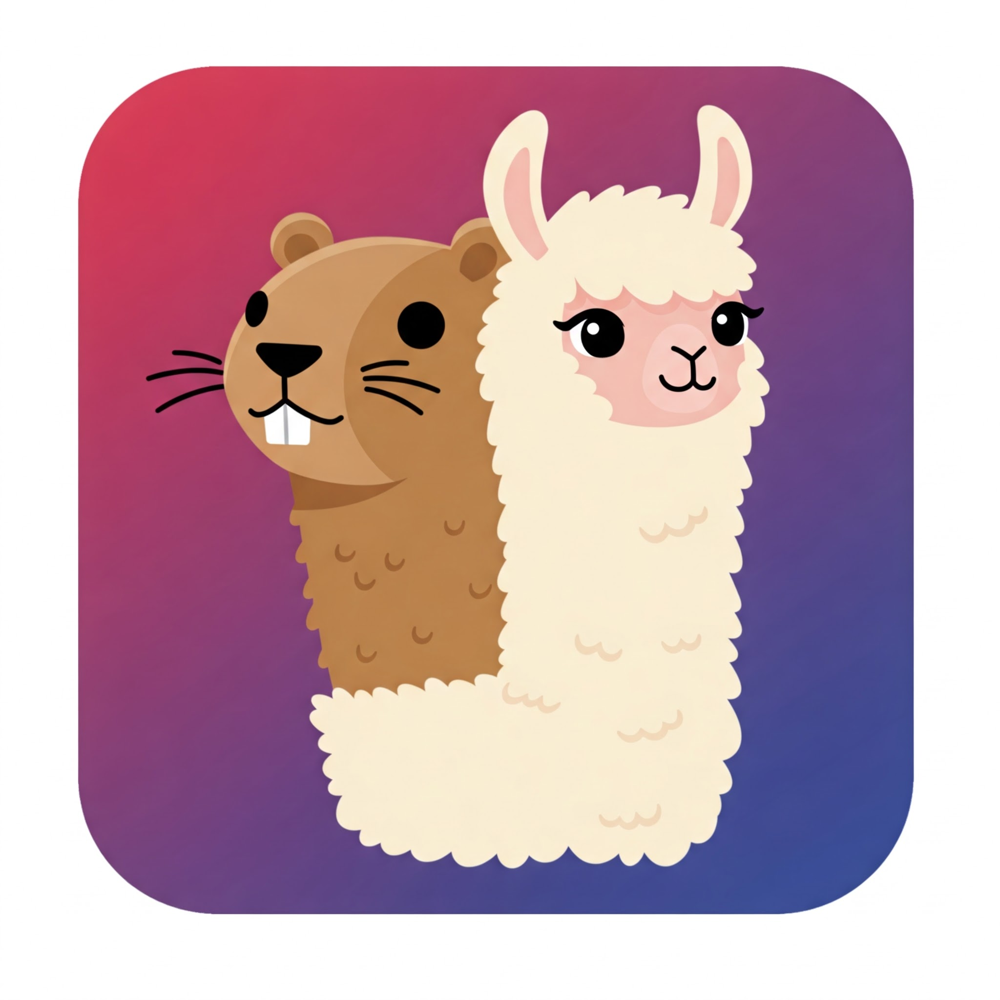

# Gollama Bubbletea

<div align="center">
  
</div>

This project provides a text user interface for chatting with Ollama LLM's using the [Bubble Tea Library](https://github.com/charmbracelet/bubbletea) and [Parakeet](https://github.com/parakeet-nest/parakeet/llm) for interfacing with Ollama.

## Prerequisites
You need [Ollama](https://ollama.com/) installed somewhere in your environment with at least one model pulled down.

## Execution
```
go run cmd/main.go
```
or
```
make run
```
Or download the binary.

## Things I want to do
- [ ] Add unit tests
- [ ] Add agent support
- [ ] Have the response from the model be written out as it is responding and not 
      all at once